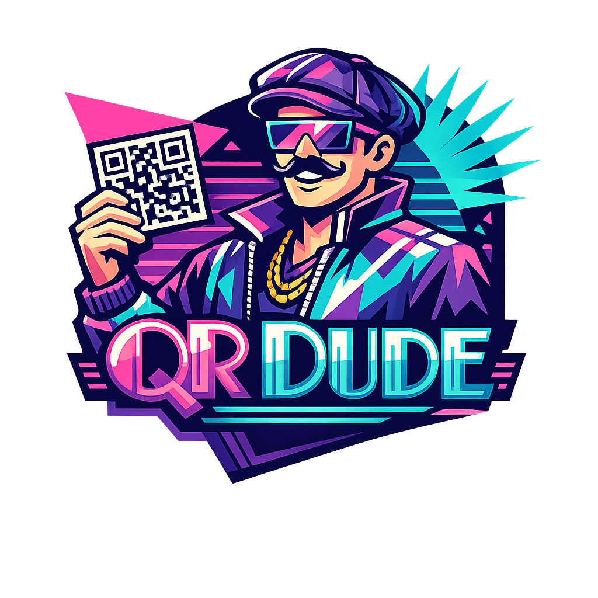

<p align="center">
  
</p>

# QRDude

Hey, you need a QR, dude?

**QRDude** is a lean, no-fuss QR code generator with two gnarly sides to it:

- a **browser demo** in `index.html`
- a **C# library** in `Class1.cs`

It takes your text or URL, builds a real QR code, and kicks out a **24-bit BMP bitmap**. No bloated UI, no mystery box SaaS energy, no weird magic cloud stuff. Just pure QR vibes and crisp little squares, bro.

## What this thing does

QRDude lets you:

- generate QR codes from **URLs**
- generate QR codes from **plain text**
- return the QR as raw **BMP bytes**
- control things like:
  - error correction level
  - QR version range
  - fixed mask selection or auto mask
  - text mode optimization
  - render scale
  - border size
  - dark/light colors

The browser version gives you a live test pad.
The C# version gives you the reusable engine.

## Live demo

You can view and test the browser version right here:

**https://metrosharesolutions.github.io/QRDude/**

Type in an `http` or `https` URL and the page instantly regenerates the QR image.
It also shows useful QR details like:

- version
- size
- mask

That makes the hosted page a clean little sandbox for seeing what the generator is doing in real time.

## Repo layout

### `index.html`
This is the all-in-one browser demo.

It includes:

- the page UI
- the QR encoder
- BMP writer
- validation logic
- live preview behavior

You open the page, type a URL, and it renders a bitmap QR right in the browser. Real simple. Real beach-ready.

### `Class1.cs`
This is the C# implementation under the `PureQR` namespace.

It gives you a reusable API for:

- creating QR BMPs from URLs
- creating QR BMPs from text
- saving BMPs directly to disk
- getting full metadata about the generated QR

## Why this project is cool

Because it stays close to the wave, dude:

- self-contained core logic
- no giant framework dependency story in the code shown here
- both browser and C# versions follow the same overall design
- clear public API
- useful result object with metadata
- practical output format you can write straight to disk

This is the kind of project where you can actually read the code and know what the tide is doing.

## Features

### URL-specific generation
There are dedicated URL methods that validate the input and require an absolute `http` or `https` URL.

### Generic text generation
If you want a QR for normal text instead of a URL, that works too.

### Smart text mode optimization
When enabled, the encoder will use:

- numeric mode
- alphanumeric mode
- byte mode

…depending on what fits best.

### Configurable output
You can change:

- error correction level
- min/max QR version
- render scale
- quiet zone border
- dark and light colors
- optional fixed mask
- optional ECC boosting

### BMP output
Output comes back as a standard **24-bit BMP** byte array, so you can save it directly or pass it around however you want.

## C# quick start

Here’s a simple example that generates a QR bitmap from a URL and saves it to disk:

```csharp
using System.IO;
using PureQR;

string url = "https://metrosharesolutions.github.io/QRDude/";
byte[] bmp = QrBitmapGenerator.CreateUrlBmp(url);

File.WriteAllBytes("qrdude.bmp", bmp);
